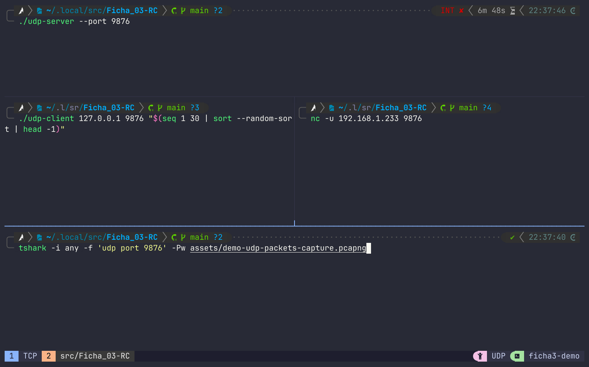

# TCP/UDP

## Compilação

Para compilar todos os executáveis:

```sh
make
```

Para compilar um executável especifico:

```sh
make tcp-server
make tcp-client
make udp-server
make udp-client
```

## Comunicação servidor-cliente em TCP

### Rodar um servidor

```sh
./tpc-server
```

Optionalmente, também é possível especificar o endereço e a porta de escuta do
servidor.
Para mais informações ver a help usage page:

```sh
./tcp-server --help

./tcp-server --address 127.0.0.1 --port 9090
```

### Rodar um cliente

```sh
./tcp-client <ip> <port>
```

### Demo


## Comunicação servidor-cliente em UDP

### Rodar um servidor

```sh
./udp-server --help

./udp-server
```

### Rodar um cliente

```sh
./udp-client <ip> <port> <number>
```

### Demo


